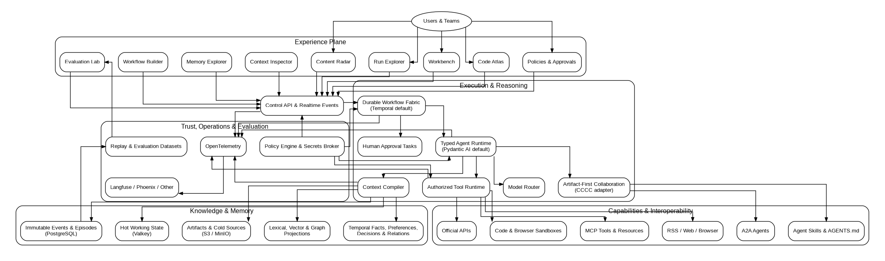
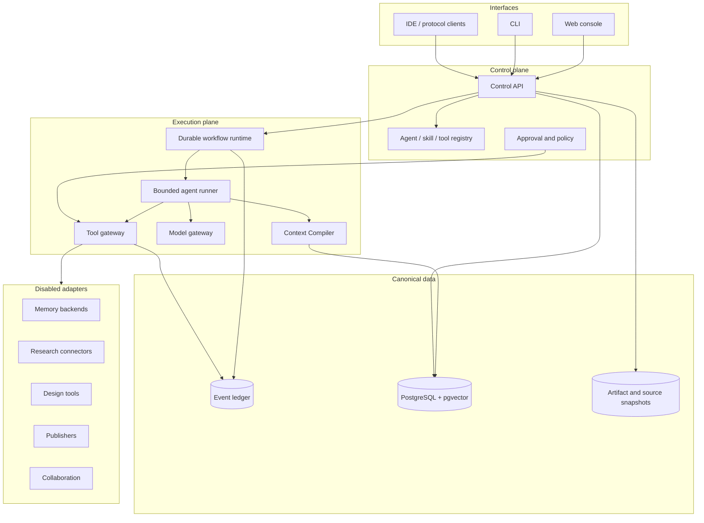

# Architecture Overview

## Product boundary


_Conceptual target architecture. Boxes are responsibilities, not a requirement to deploy each as a separate service._


Open Agent Fabric is a local-first control plane for building, running, inspecting, and improving agents. It owns portable domain state: workspaces, runs, workflows, events, context manifests, memories, evidence, approvals, policies, artifacts, evaluations, and adapter metadata.

It does not own foundation models, third-party agent framework internals, social platforms, or upstream memory products. Those enter through replaceable adapters.

## Logical architecture



## Core planes

### Control plane

Defines identities, workspaces, workflows, agents, tools, skills, budgets, policies, approvals, schedules, versions, and adapter configuration. It contains deterministic authority.

### Execution plane

Runs bounded steps. A durable workflow engine handles retries, timers, suspension, recovery, and compensation. Agent runners handle model interaction inside one step. Models do not control authorization or workflow durability.

### Context plane

Normalizes candidates and compiles the smallest sufficient context. It resolves scope, lifecycle, time, supersession, conflicts, relevance, diversity, risk, and budget before a model call.

### Data plane

Stores canonical events and state. Source snapshots and large artifacts use object storage. Semantic indexes and knowledge graphs are derived indexes, not authoritative records.

### Experience plane

Presents outcome first, explanation second, trace third. Chat is optional. Runs, sources, memories, artifacts, approvals, and manifests have stable URLs.

## Bootstrap versus target

The current bootstrap uses Node's built-in HTTP server, file-backed local state, deterministic generation, synthetic observations, an in-process workflow runner, and a dependency-free static interface.

The target production profile replaces these behind contracts with PostgreSQL, durable workflows, explicit local model servers, content-addressed object storage, authentication, OpenTelemetry, and optional adapters. The bootstrap remains a fast offline conformance environment.

## Deployment profiles

**Offline bootstrap:** no network, model, or database. Used for onboarding, CI, deterministic tests, and protocol work.

**Local workstation:** control API, web app, PostgreSQL/pgvector, local object storage, local model server, and optional durable runtime.

**Team self-hosted:** adds authentication, encrypted secrets, backups, sandbox workers, policy service, tracing, and isolated adapter workers.

## Reliability model

Each step has typed input and output, context policy, allowed tools, side-effect class, timeout, retry policy, validation, approval requirement, and compensation behavior. External writes use idempotency keys. Events support replay and audit, but migrations still govern projection compatibility.

## Native reliability layer

The core always has a local baseline. `providers/native/` implements the same ports that future PostgreSQL, Temporal, Mem0, Graphify, or other integrations implement. Workflows and UI code do not know which provider is active.

The local baseline includes SQLite/FTS5 memory, content-addressed filesystem artifacts, an embedded workflow runtime, deterministic generation behind the local model gateway, and an explicit loopback-only Ollama option. Read `native-providers.md` and `model-gateway.md` for limitations.

## Portable execution contract

Agent Packs package model capability requirements, context and memory policy, requested tools, skills, workflows, permissions, UI surfaces, and evaluation references. They contain no credentials and grant no authority. Runtime policy resolves and authorizes a pack before activation.

## Reliability loop

```text
record → inspect → replay without effects → compare → propose change
       → run in shadow → evaluate → approve → version → monitor → roll back
```

The flight recorder is a canonical event and artifact view, not hidden chain-of-thought. It records selected context, actions, policy decisions, evidence, versions, and outcomes required for reproducibility.
