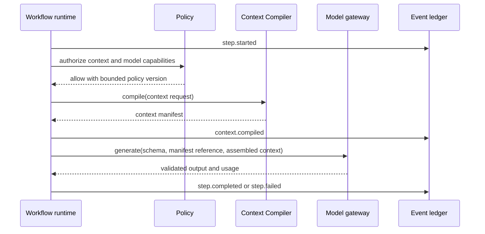
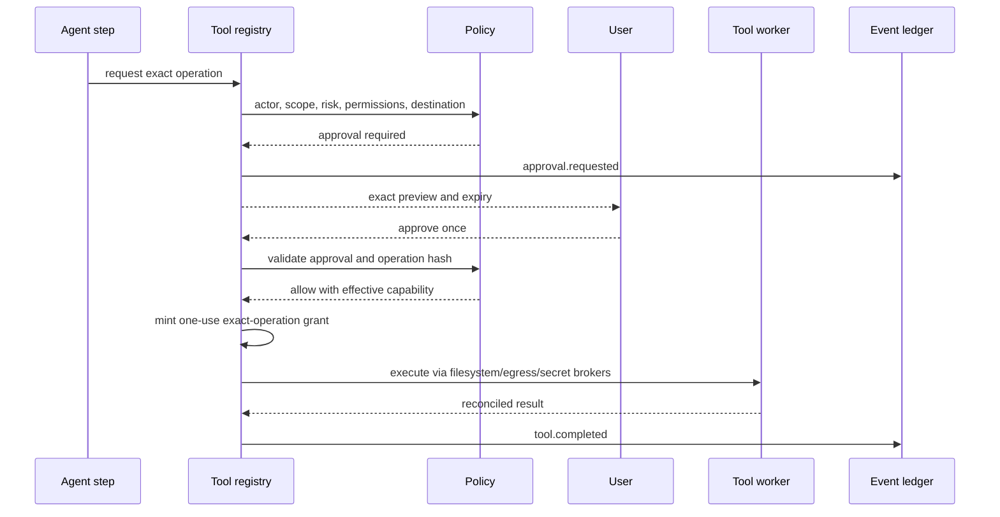
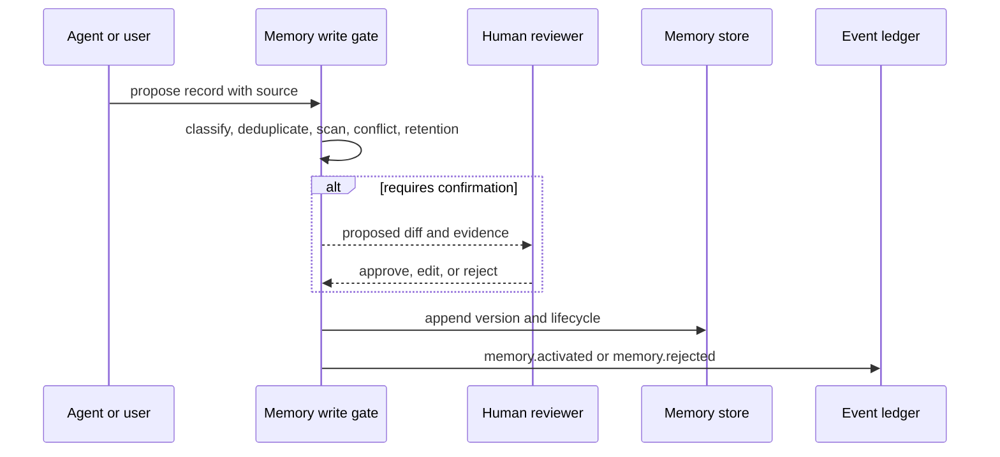
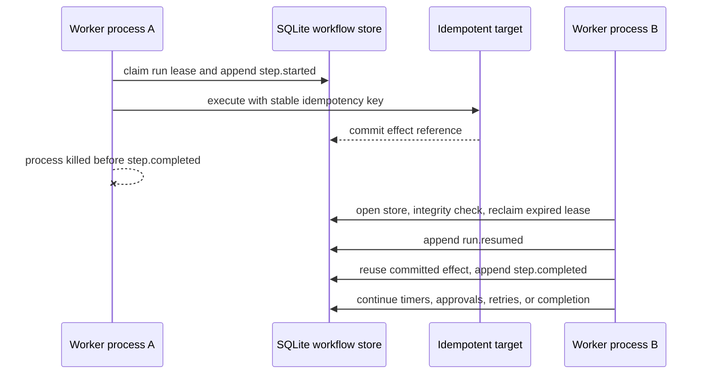

# Core Sequence Flows

## Model-backed workflow step

## Consequential tool call

The broker never receives caller-supplied authority fields. For local writes,
the tool handler uses the OAF-014 durable idempotent effect boundary before the
result is treated as reconciled.

## Memory proposal

## Context failure behavior

If any candidate source fails, the manifest records the source failure. The compiler must not silently widen allowed scope, drop governance records, or substitute an unapproved source. Required governance that cannot fit the budget is a hard, explainable failure.

## Durable workflow recovery

The recovery path does not restore JavaScript closures. It resumes from the
persisted definition, step state, attempts, timers, approvals, leases, events,
and idempotency records.
