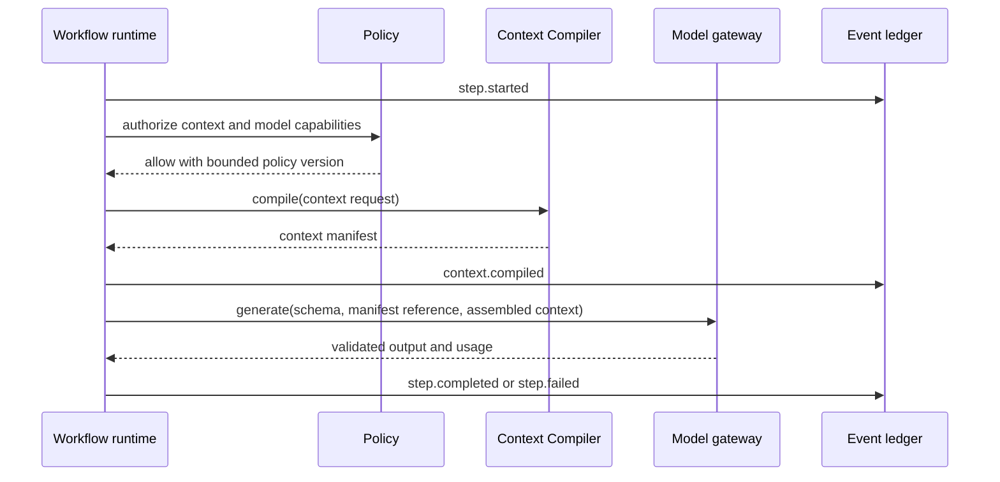
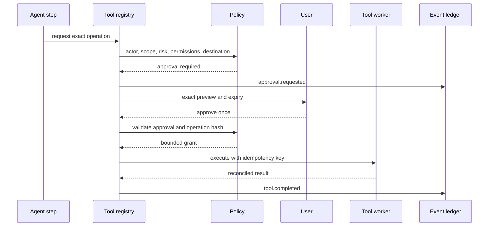
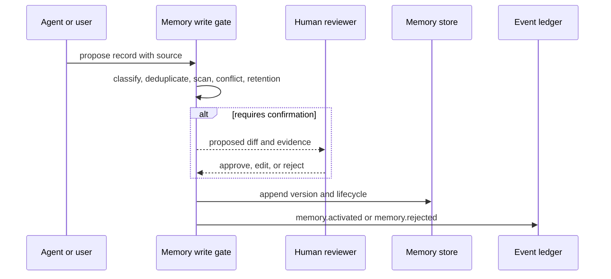

# Core Sequence Flows

## Model-backed workflow step

## Consequential tool call

## Memory proposal

## Context failure behavior

If any candidate source fails, the manifest records the source failure. The compiler must not silently widen allowed scope, drop governance records, or substitute an unapproved source. Required governance that cannot fit the budget is a hard, explainable failure.
