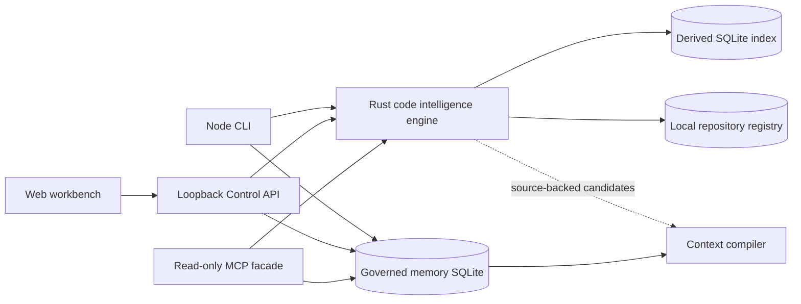

# Memory Recall Polyglot Code Intelligence Design

**Date:** 2026-07-16  
**Status:** Approved for implementation
**Goal:** Match or beat GitNexus on its documented developer workflows while preserving Memory Recall's governed temporal memory, source evidence, compact delivery, and verified handoffs.

## Decision

Memory Recall will promote its existing Rust Tree-sitter implementation into the production code-intelligence engine. Node.js remains the product shell for the public CLI, loopback Control API, governed memory workflow, MCP compatibility, and web workbench.

The first production language tier covers the same fourteen languages documented by GitNexus:

- TypeScript;
- JavaScript;
- Python;
- Java;
- Kotlin;
- C#;
- Go;
- Rust;
- PHP;
- Ruby;
- Swift;
- C;
- C++;
- Dart.

The existing Lua, Bash, SQL, Objective-C, Scala, R, Julia, and Zig parsers remain experimental until they pass the same language-quality gates. A parser crate or successful syntax tree does not qualify as product support.

Memory Recall will not copy GitNexus or Codebase Memory MCP source or expose either project as its runtime engine. GitNexus is the primary reference for fourteen-language workflow depth. Codebase Memory MCP is the primary reference for parser breadth, native distribution, indexing throughput, query latency, and large-repository scale. Memory Recall owns its schema, indexing, query behavior, release artifacts, safety boundary, and user experience.

Raw parser count is not the definition of leadership. Codebase Memory MCP currently documents substantially more grammars than this Tier 1 plan. Memory Recall will first prove deeper shared-language correctness and developer-task quality, then expand its language tiers under the same gates. It cannot claim language-count leadership while that count remains lower.

## Current state

The public Node.js path supports JavaScript and TypeScript source graphs. It persists a bounded JSON index and exposes twelve read-only MCP tools for orientation, search, context, trace, dependencies, routes, impact, governed memory, and handoff context.

The repository also contains an experimental Rust runtime with Tree-sitter grammars for twenty-two language groups, SQLite storage, graph queries, local semantic search, community detection, routes, typed-call work, a read-only MCP server, and release-quality harnesses. That runtime is not the public default. The npm package ships Rust source but no compiled binary, and the workbench does not use the Rust graph.

The work is therefore an integration, correctness, distribution, and proof program. It is not a request to add fourteen filename extensions to the JavaScript scanner.

## Success definition

The project may state that it matches GitNexus only after all of the following are true:

1. All fourteen Tier 1 languages pass the published support matrix.
2. The packed npm product installs and runs on each supported platform without a Rust toolchain.
3. CLI, MCP, Control API, and web Map read the same production index.
4. Incremental refresh, watcher behavior, migrations, and corruption recovery pass their failure tests.
5. Multi-repository queries preserve workspace boundaries and expose evidence for every cross-repository relationship.
6. A reproducible head-to-head corpus against GitNexus and, where the capability is shared, Codebase Memory MCP shows that Memory Recall meets the accuracy, performance, scale, and usability floors.
7. Existing governed-memory, handoff, protocol, evaluation, consumer-install, and browser gates remain green.

The project may state that it leads a measured category only when the public benchmark shows a material win against each relevant reference in that category. Tool counts, parser counts, and generated fixtures are not sufficient evidence.

## Product boundary

Memory Recall combines two jobs:

1. explain code structure with bounded, source-backed metadata;
2. preserve reviewed repository context across sessions and agents.

The code graph is derived local state. It is never canonical memory. Structural facts extracted from source may be refreshed automatically in an explicit local indexing process. Interpretations that could become durable memory remain proposals and require review.

The following invariants remain unchanged:

- MCP is read-only;
- repository text cannot change policy or grant authority;
- normal MCP results contain locators and bounded metadata, not raw source bodies;
- no cloud service or model call is a silent fallback;
- network activity is explicit and off by default;
- indexes stay workspace-scoped;
- external writes require a separate authority path;
- token figures are local delivery estimates unless a provider supplies billing usage.

## System architecture

### Node responsibilities

Node.js continues to own:

- public `recall` commands and compatibility aliases;
- setup preview, confirmation, client configuration, doctor, and uninstall;
- loopback HTTP routes and authentication boundary;
- governed memory proposal, approval, rejection, and supersession behavior;
- context-pack composition and delivery accounting;
- web assets and browser interaction;
- protocol validation and release orchestration.

### Rust responsibilities

The Rust engine owns:

- repository discovery and ignore handling;
- language detection and parsing;
- symbol, declaration, import, export, heritage, route, and call extraction;
- cross-file and cross-repository resolution;
- persistent structural indexing and migrations;
- incremental invalidation and watcher scheduling;
- lexical, structural, and local semantic retrieval;
- communities, execution processes, architecture ranking, trace, and impact primitives;
- bounded read-only query execution.

### Process boundary

Node communicates with the Rust engine through versioned JSON Lines over stdin and stdout. Each request includes:

- protocol version;
- request ID;
- workspace or repository ID;
- operation;
- bounded arguments;
- deadline;
- cancellation token when the caller can cancel;
- requested response schema version.

Stdout contains protocol frames only. Diagnostics use stderr with stable error codes and sanitized paths. The wrapper enforces timeouts, output limits, process termination, and workspace containment.

The initial integration uses a subprocess because it keeps the native boundary replaceable and testable. An in-process Node native binding is not required for the first production release.

## Code-intelligence schema

The new schema replaces language-specific public payloads with a stable intermediate representation.

### Node kinds

- repository;
- directory;
- file;
- package or module;
- namespace;
- function;
- method;
- class;
- interface;
- struct;
- enum;
- trait or protocol;
- type alias;
- variable or constant when public or structurally relevant;
- route;
- configuration resource;
- framework component;
- execution process;
- community.

Language-specific constructs map to the closest stable kind and retain a `languageKind` field. The public identifier must not depend on a Tree-sitter node name.

### Edge kinds

- contains;
- defines;
- imports;
- exports;
- re_exports;
- references;
- calls;
- constructs;
- inherits;
- implements;
- extends;
- handles_route;
- reads;
- writes;
- emits;
- listens;
- depends_on;
- member_of;
- process_step;
- cross_repo_depends_on.

Every resolved edge includes:

- source and target IDs;
- source locator and evidence span;
- resolver name and version;
- confidence score;
- resolution class: exact, typed, inferred, lexical, or unresolved;
- language;
- index generation;
- stale state.

An unresolved relationship remains an explicit unresolved record. It must not be converted into a confident edge for graph density.

### Identity

Canonical structural IDs use repository identity, normalized workspace locator, stable kind, qualified name, and declaration span. Rename detection may preserve continuity through a separate lineage relation, but a guessed rename must not silently reuse an old identity.

Absolute paths, user names, credentials, source bodies, and volatile parser object IDs are excluded from public identifiers.

## Persistent index

The production index is an embedded SQLite database under `.local/source-index/`. The exact filename is versioned by the storage ADR.

The index contains:

- repository identity and schema version;
- file manifest with content hash, size, language, parse status, and ignore fingerprint;
- normalized nodes and edges;
- evidence spans without raw source bodies;
- unresolved relationships;
- package and framework metadata;
- lexical search tables;
- local semantic search state when enabled;
- community and process projections;
- benchmark-safe measurements;
- migration and health records.

### Incremental refresh

Refresh performs these steps:

1. Load and validate the current index identity.
2. Discover files using the current ignore and workspace rules.
3. Compare content hashes, not modification time alone.
4. Remove deleted files and their owned records.
5. Parse added and changed files.
6. Re-resolve directly affected imports, calls, heritage, routes, processes, and communities.
7. Commit the next generation atomically.
8. Leave the previous valid generation available until commit succeeds.

A no-change refresh writes nothing. A parser failure for one supported file records partial coverage and preserves the rest of the valid generation. Database corruption never triggers silent deletion; doctor reports it and offers an explicit rebuild plan.

### Watch mode

Watch mode is opt-in, local, debounced, bounded, and stoppable. It schedules refresh work but does not modify canonical memory. It must handle editor temporary files, rename storms, branch changes, and directory replacement without unbounded queues.

### Large-repository behavior

The engine never materializes the entire graph in an MCP response or browser payload. Queries use indexes and bounded traversals. The Map receives grouped summaries first, then focused neighborhoods.

Million-node support requires a benchmark that records build time, refresh time, query latency, peak RSS, index size, file count, node count, edge count, platform, and failure behavior. Until that gate passes, the public scale boundary remains smaller and explicit.

## Language support contract

### Capability columns

The public support matrix uses these columns:

| Capability | Meaning |
| --- | --- |
| Parse | Supported files produce syntax-backed declarations without crashing the repository scan. |
| Structure | Language-relevant functions, methods, types, packages, and modules are represented. |
| Imports | Imports, includes, uses, aliases, and package dependencies are extracted. |
| Exports | Public/exported bindings and re-exports are represented where the language exposes them. |
| Heritage | Inheritance, interfaces, traits, protocols, mixins, or equivalent relationships are resolved. |
| Types | Type annotations and receiver information contribute to resolution. |
| Calls | Calls resolve across files with a confidence class and no module-as-function targets. |
| Config | Toolchain and package configuration contributes to module resolution. |
| Frameworks | Named supported frameworks produce routes, handlers, components, or entry points. |
| Impact | Changed-file impact follows verified incoming relationships and reports omissions. |
| Processes | Entry-point-to-sink execution processes are detected with evidence. |

Values are `full`, `partial`, `parse-only`, or `unsupported`. A row cannot say `full` based only on synthetic fixtures.

### Tier 1 release batches

| Batch | Languages | Main resolution work |
| --- | --- | --- |
| A | JavaScript, TypeScript | Preserve current behavior, add typed parity, unified schema, and regression corpus. |
| B | Python, Go, Rust | Module systems, receiver resolution, traits/interfaces, common service frameworks. |
| C | Java, Kotlin, C# | Package and namespace resolution, overload handling, heritage, annotations, application frameworks. |
| D | C, C++, Swift, Dart | Header/module relationships, type receivers, protocols, framework entry points, bounded ambiguity. |
| E | PHP, Ruby | Dynamic dispatch confidence, package conventions, Rails/Laravel/Symfony structure. |

The batch order does not permit a partial release to claim all fourteen languages. Preview releases may name exactly which rows passed.

### Initial framework targets

| Ecosystem | Required first targets |
| --- | --- |
| JavaScript and TypeScript | Node HTTP, Express, Fastify, NestJS, Next.js server routes |
| Python | Flask, FastAPI, Django URL configuration |
| Go | `net/http`, Gin, Echo, Chi |
| Rust | Axum, Actix Web, Rocket |
| Java and Kotlin | Spring MVC, Spring Boot, Ktor |
| C# | ASP.NET Core controllers and minimal APIs |
| PHP | Laravel and Symfony routing |
| Ruby | Rails routes and controllers |
| Swift | Vapor routes |
| Dart | Shelf routes and Flutter application entry points |
| C and C++ | executable/library entry points and build-target relationships; no invented HTTP framework support |

Framework detection must be syntax-backed or configuration-backed. String matching alone may create candidates but cannot create a high-confidence route.

## Resolution pipeline

The engine executes a deterministic pipeline:

1. discover files and configuration;
2. parse syntax trees;
3. extract declarations and lexical relationships;
4. build package, namespace, and module maps;
5. resolve imports, exports, aliases, and re-exports;
6. resolve heritage and explicit types;
7. infer receiver and constructor types where bounded rules exist;
8. resolve calls with confidence classes;
9. detect framework routes and entry points;
10. build dependency and impact projections;
11. detect communities and execution processes;
12. build lexical and optional local semantic search indexes;
13. validate invariants and commit the generation.

Language adapters provide queries and normalization rules. Shared resolution logic consumes the normalized declarations. This avoids one large switch statement that mixes every language's syntax, package rules, and framework rules.

## Search and structural intelligence

### Search

`code.search` combines:

- exact qualified-name lookup;
- identifier and path matching;
- SQLite FTS ranking;
- graph-neighbor evidence;
- optional model-free local semantic ranking;
- optional local embedding ranking only when explicitly installed and enabled.

The default path makes no network call. Every result exposes the signals that affected rank. The benchmark compares keyword, hybrid, and file-search baselines separately.

### Context

`code.context` returns one selected declaration or file with bounded containing, incoming, outgoing, heritage, route, process, and community context. Ambiguous matches return ranked candidates instead of selecting silently.

### Trace and dependencies

Traversals require edge filters, direction, depth, result limit, and time budget. Cycles are reported and bounded. The result includes omitted counts and truncation reasons.

### Impact

Impact starts from a git diff, explicit locators, or a symbol. It distinguishes:

- directly changed declarations;
- exact dependants;
- high-confidence typed dependants;
- lower-confidence inferred dependants;
- unresolved risk;
- files omitted by language, ignore, size, or index bounds.

An impact result never states that a file will break unless the evidence class supports that wording.

### Communities

Community detection groups structural nodes using a deterministic versioned algorithm. A community label comes from repository names and paths by default. Model-generated labels are optional interpretations and never replace the stable community identity.

### Processes

Execution processes begin at detected entry points and follow bounded high-confidence paths toward routes, handlers, storage, queues, emitted events, or other sinks. Each step retains its underlying edges. A process is a projection, not a new source fact.

### Safe graph query

`code.query` accepts a constrained structured query object. It does not execute arbitrary SQL, Cypher, JavaScript, shell, or downloaded code. The schema limits node kinds, edge kinds, filters, direction, depth, sort, offset, limit, and deadline.

## MCP contract

The existing tools remain compatible:

- `memory.recall`;
- `context.profile`;
- `context.pack`;
- `repo.map`;
- `repo.architecture`;
- `repo.index_status`;
- `code.search`;
- `code.context`;
- `code.trace`;
- `code.dependencies`;
- `code.routes`;
- `code.impact`.

Four task-distinct additions are permitted after their primitives pass:

- `repo.list` for local indexed repositories and freshness;
- `repo.communities` for functional areas and evidence;
- `code.processes` for entry-to-sink flows;
- `code.query` for constrained structural queries.

All tools include schema version, repository identity, index generation, freshness, coverage, provenance, truncation, and token-delivery measurements. MCP calls do not build, refresh, migrate, repair, or delete indexes.

## Multi-repository design

The local registry contains repository IDs, display names, workspace-contained index locations, root identity hashes, last-seen state, and freshness. It stores no source bodies.

One MCP server may read multiple registered indexes. Connections open lazily and use a strict pool bound. Repository selection is explicit when more than one repository can answer a query.

Cross-repository edges require evidence from:

- workspace and package manifests;
- import paths and package coordinates;
- Go modules and Cargo dependencies;
- Maven, Gradle, NuGet, Composer, and Ruby package metadata;
- protobuf or gRPC definitions;
- GraphQL schemas and generated client bindings;
- explicitly configured repository relationships.

Name similarity alone never creates a cross-repository edge. Registry changes, index writes, and relationship refresh are CLI operations, not MCP operations.

## npm distribution

The public package remains `memory-recall`. Platform binaries ship through optional platform packages selected by npm.

Initial supported targets:

- macOS arm64;
- macOS x64;
- Linux x64 GNU;
- Linux arm64 GNU;
- Windows x64.

Linux musl and Windows arm64 become supported only after their consumer gates pass.

The Node wrapper verifies the selected binary version and checksum before use. It never downloads an executable from an arbitrary runtime URL. Missing or invalid native packages produce an actionable doctor result.

The JS/TS provider may remain as reduced mode during migration. Reduced mode must say that polyglot, multi-repository, semantic, and large-index behavior is unavailable. It cannot present Tier 1 coverage.

Release artifacts include:

- checksums;
- software bill of materials;
- dependency and grammar license inventory;
- build provenance;
- macOS signing and notarization evidence;
- Windows signing evidence when Windows is called supported;
- isolated packed-package installation results.

## Workbench and Map

The workbench keeps the task-based navigation: Start, Explore code, Review memory, Prepare handoff, and Settings.

### Start

The first screen shows:

- repository and active branch;
- language coverage with full, partial, and unsupported counts;
- index freshness;
- important subsystems;
- entry points and hotspots;
- changed-file impact summary;
- governed-memory proposal and current-fact counts;
- handoff readiness;
- one recommended next action.

It does not use competitive claims, decorative metrics, or graph terminology as onboarding copy.

### Explore code

Map uses progressive disclosure:

1. repository groups and languages;
2. functional communities;
3. execution processes;
4. focused symbol or file neighborhood;
5. exact relationship evidence.

The canvas is never the only representation. A synchronized outline provides the same selected structure for keyboard and assistive-technology users. Labels use collision-aware placement, focus priority, controlled wrapping, and zoom thresholds.

Large graphs are summarized by the engine. The browser does not receive a million-node payload. Layout work stays off the main thread, and every request has a visible loading, empty, partial, error, or ready state.

### Settings

Settings exposes real paths, engine version, supported languages, reduced-mode state, index bounds, registry state, watcher state, privacy rules, and rebuild or repair commands. It does not expose design tokens or internal component examples.

## Security and failure behavior

The implementation must test:

- symlinks that escape the workspace;
- case-sensitive and case-insensitive path collisions;
- invalid UTF-8 and malformed syntax;
- oversized and generated files;
- parser panics and timeouts;
- poisoned or incompatible index files;
- interrupted migrations;
- watcher storms;
- branch switches and repository replacement;
- path and user-name leakage;
- crafted repository text that resembles instructions;
- decompression and allocation bombs in supported formats;
- traversal queries intended to exhaust CPU or memory;
- registry entries that point outside allowed roots;
- version mismatch between Node wrapper and native binary.

The engine returns stable failure codes. Partial coverage remains usable and visible. A failed file or query cannot silently broaden filesystem or network access.

## Benchmark design

The benchmark runs Memory Recall, GitNexus, Codebase Memory MCP where it supports the tested capability, and a file-by-file baseline against the same pinned repository commits. Each product keeps its documented configuration. The report separates vendor claims from measurements produced by this corpus.

### Corpus

The public corpus contains:

- at least three pinned real repositories for each Tier 1 language;
- small gold fixtures for exact declarations, imports, calls, heritage, routes, and impact;
- mixed-language monorepositories;
- two-repository and multi-repository dependency fixtures;
- malformed-source and unsupported-language fixtures;
- generated large repositories for controlled scale;
- at least one large real repository that fits the machine budget.

Repository licenses must permit benchmark use and redistribution of derived gold metadata. Commit hashes, acquisition commands, exclusions, and expected facts are recorded.

### Metrics

Correctness:

- symbol precision and recall;
- import/export resolution precision and recall;
- call-edge precision and recall by confidence class;
- heritage precision and recall;
- route and handler precision and recall;
- changed-file impact precision and recall;
- process-step precision and recall;
- duplicate canonical identity count;
- unsupported and partial-coverage honesty.

Retrieval:

- Recall@5 and Recall@10;
- MRR and NDCG@10;
- task-answer sufficiency;
- tool calls per task;
- delivered tokens per task;
- omitted relevant evidence.

Performance:

- cold index wall time and peak RSS;
- warm open latency;
- no-change refresh;
- one-file and one-package refresh;
- query p50, p95, and p99;
- on-disk size;
- watcher convergence and backlog;
- browser payload size and interaction latency.

### Minimum floors

Before a language is `full`:

- symbol recall is at least 95 percent;
- resolved-call precision is at least 90 percent;
- no duplicate canonical symbol IDs exist in the gold corpus;
- deterministic reruns produce the same structural fingerprint;
- malformed files do not fail the repository scan;
- partial and unsupported cases emit explicit diagnostics;
- all real-repository language gates pass.

These are minimum floors, not automatic leadership claims. The head-to-head report publishes both products' results and limitations without rewriting vendor claims as independent facts.

## Verification layers

### Focused tests

- language adapter unit tests;
- per-language gold fixtures;
- resolver property tests;
- index migration and corruption tests;
- watcher and cancellation tests;
- registry isolation tests;
- MCP schema, bound, and zero-write tests;
- Node/native protocol compatibility tests;
- UI model and rendering tests.

### Integration tests

- fresh index, process restart, refresh, and query;
- branch switch and rename handling;
- mixed-language cross-file calls;
- framework route-to-handler-to-storage flow;
- multi-repository dependency and impact;
- reduced-mode behavior;
- current and previous schema migration;
- interrupted process and index recovery.

### Release tests

- `cargo test --manifest-path rust/Cargo.toml`;
- all Rust quality harnesses relevant to the changed milestone;
- `npm run ci`;
- `npm run protocol:validate`;
- `npm run consumer:smoke` against the packed artifact;
- browser smoke and manual route audit;
- release-readiness and handoff verification;
- platform package installation in isolated homes;
- head-to-head benchmark reproduction.

## Migration and compatibility

The migration proceeds behind the existing public tools.

1. Introduce the native-engine protocol and schema without changing the default provider.
2. Run JS/TS parity tests against both engines.
3. Enable the Rust engine by explicit preview flag.
4. Build indexes in a new path. Do not mutate the existing JSON index in place.
5. Promote the Rust engine to default only after JS/TS compatibility and packed-consumer gates pass.
6. Keep the reduced JS/TS provider for one documented compatibility window.
7. Remove the old primary index only after migration, rollback, and uninstall paths are verified.

Existing MCP names and core response fields remain compatible. New coverage, confidence, repository, and process fields are additive. Breaking schema changes require a versioned endpoint or major protocol version.

## Execution phases and gates

### Phase 0: contract and baseline

Deliver the storage ADR, native protocol schema, code-intelligence schema, support matrix, benchmark manifest, and baseline measurements. Stop if licenses, platform packaging, or current Rust quality invalidate the proposed direction.

### Phase 1: unified provider

Connect Node to Rust behind a provider port. Prove JS/TS result compatibility, zero-write MCP reads, process bounds, cancellation, error codes, and isolated packed-product behavior.

### Phase 2: fourteen-language Tier 1

Complete language batches A through E. Each batch lands only with fixture and real-repository evidence. Public docs name exact per-language capability values.

### Phase 3: production index

Land SQLite storage, incremental refresh, dependency invalidation, watcher behavior, migrations, recovery, and large-repository query bounds.

### Phase 4: intelligence parity

Complete hybrid search, communities, processes, routes, impact, confidence, and constrained graph queries. Add the four MCP tools only after their primitives pass.

### Phase 5: multi-repository

Land the registry, bounded connection pool, repository selection, evidence-backed cross-repository edges, cross-repository search, trace, and impact.

### Phase 6: distribution

Ship signed platform packages, wrapper selection, version and checksum verification, setup, doctor, update, uninstall, provenance, and isolated platform consumer tests.

### Phase 7: workbench

Move Start, Map, Settings, memory context, and handoff context to the unified engine. Complete browser, accessibility, responsive, performance, and anti-slop review.

### Phase 8: benchmark and gap closure

Run the pinned head-to-head corpus. Fix measured correctness, retrieval, performance, installation, and usability gaps. Publish only claims that survive reproduction.

### Phase 9: broader formats

Promote the eight existing experimental languages under the Tier 1 gates. Then add high-value structural formats such as GraphQL, Protocol Buffers, Terraform/HCL, Dockerfiles, YAML/Kubernetes, Vue, and Svelte through separate capability rows.

## Risks and controls

| Risk | Control |
| --- | --- |
| Native distribution makes install fragile | Optional platform packages, isolated consumer tests, checksum/version validation, explicit reduced mode. |
| Parser count is mistaken for quality | Capability matrix, real repositories, precision and recall floors, explicit partial states. |
| Rust and Node produce conflicting truth | One provider-neutral schema and one production index; parity tests before default switch. |
| Dynamic languages create false call edges | Confidence classes, unresolved records, precision floors, no density-driven guessing. |
| Large graphs overwhelm UI or MCP | Query-time bounds, grouped summaries, pagination, progressive disclosure, payload budgets. |
| Multi-repo analysis crosses privacy boundaries | Local registry, explicit repository selection, workspace containment, no source bodies in registry. |
| Watcher corrupts or churns the index | Debounce, bounded queue, atomic generations, interruption tests, explicit repair. |
| Competitive work causes copied architecture or claims | Independent implementation, license review, pinned benchmark inputs, direct evidence. |
| Broader code intelligence weakens memory governance | Derived graph remains separate from canonical memory; interpretations stay proposal-gated. |

## Acceptance criteria

- The production package supports all fourteen Tier 1 languages at documented capability levels.
- Every `full` capability is backed by fixtures, real repositories, and published metrics.
- The public package installs without a compiler on supported targets.
- Node, MCP, API, and web workbench use one versioned production index.
- No-change refresh writes nothing; changed refresh reparses and re-resolves only affected scope.
- Corrupt, stale, partial, unsupported, reduced-mode, and version-mismatch states are explicit and recoverable.
- The twelve existing MCP tools remain compatible and make zero index or memory writes.
- New MCP tools are bounded, source-backed, and added only after their underlying operations pass.
- Multi-repository results name the repository and evidence for every relationship.
- Map remains readable and operable without receiving the entire graph.
- All existing verification remains green and the new native, language, scale, platform, browser, and security gates pass.
- The head-to-head report supports every parity or leadership statement made in README or release material.
- Push, merge, npm publish, deployment, and public release remain separate user-authorized actions.

## References

- GitNexus README, supported language matrix and indexing pipeline: <https://github.com/nxpatterns/gitnexus>
- Codebase Memory MCP README, broad-language and large-index reference: <https://github.com/DeusData/codebase-memory-mcp>
- Existing Memory Recall task-first design: `docs/superpowers/specs/2026-07-16-memory-recall-task-first-code-intelligence-design.md`
- Existing Rust runtime: `rust/README.md`
- Existing Rust parser: `rust/oaf-ingest/src/lib.rs`
- Current Node JS/TS provider: `providers/native/context-candidate-ast-code/src/index.mjs`
